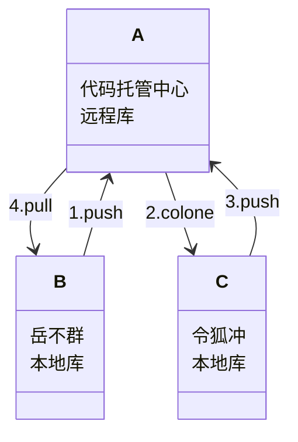

# 基础操作流程

- creat a new document.
  - `vim 'filename'` hint: `.txt`
  - `i` -> insert , `Esc` -> exit, `:wq` -> save the document
    - 参见相关的Linux命令
- `git add` : 加入暂存区
- `git commit -m "second commit" filename` : 提交本地库
- `git status` : 查看状态
- `git reflog` : 查看版本信息
- 使用指针进行历史版本的问题

# 历史版本的问题

- `git reflog` : 找到相关的版本号
- `git reset --hard 版本号` : 
- 此时的版本已经发生了改变
- 主要是使用了指针的原理进行操作

# 分支操作

- 什么是分支
  - 为不同的任务创建自己的分支, 底层实际上指针的引用
- `git branch -v`: check
- `git branch branchname`: creat a new branch
- `git checkout hot-fix` : change branch
- `git merge` : ...merge...
- 冲突合并
  - 需要使用`vim filename`直接进入内部进行修改

# 团队协作机制

## 团队内协作

- `push` : 上传上去(必须加入相关的团队)
- `clone` : 复制到本地库
- `pull` : 拉取代码(更新本地库的代码)

## 跨团队合作

- `fork`: 作为一个分支, `叉`过来
- `clone` : 到本地库
- `push` : 到远程库
- `Pull request` 
- `merge`
- `pull`
